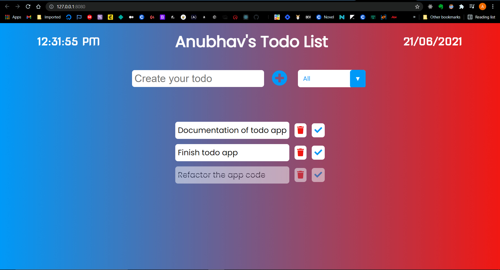

# Todo App

## Project Description

- This is simple to-do checklist app for our daily needs.
- We can add our daily goals here.
- We can mark the tasks as completed, once they are done.
- We can delete the tasks, if we don't need them anymore.
- Tasks will remain stored here until we delete them.

## License

[](https://github.com/tterb/atomic-design-ui/blob/master/LICENSEs)

## Tech Stack

- **Vanilla Javascript**
- **HTML5**
- **CSS3**

## Screenshot



## Lessons Learned

What did you learn while building this project? What challenges did you face and how did you overcome them?

## Optimizations

What optimizations did you make in your code? E.g. refactors, performance improvements, accessibility

## Run Locally

Clone the project

```bash
  git clone https://github.com/Anubhavdxt/todo-app
```

Go to the project directory

```bash
  cd my-project
```

Install live-server

```bash
  npm install live-server
```

Start the server

```bash
  live-server
```

## Contributing

Contributions are what make the open source community such an amazing place to be learn, inspire, and create. Any contributions you make are greatly appreciated.

1. Fork the Project
2. Create your Feature Branch (`git checkout -b feature/AmazingFeature`)
3. Commit your Changes (`git commit -m 'Add some AmazingFeature`)
4. Push to the Branch (`git push origin feature/AmazingFeature`)
5. Open a Pull Request

## Support

For support, email anubhavdxt46@gmail.com.

## Acknowledgements

- [Dev Ed YouTube](https://www.youtube.com/channel/UClb90NQQcskPUGDIXsQEz5Q)
- [README.SO](https://readme.so)

## Authors

- [@Anubhavdxt](https://www.github.com/Anubhavdxt)
